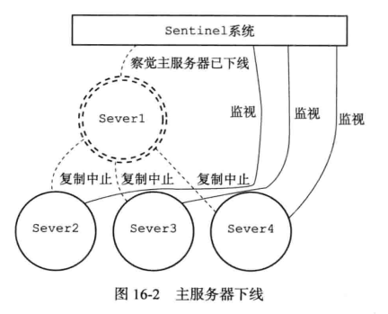

## Sentinel

Sentinel ( 哨岗、哨兵 ) 是 Redis 高可用性 ( high availability ) 解决方案：由一个或多个 Sentinel 实例 ( instance ) 组成的 Sentinel 系统 ( system ) 可以监视任意多个主服务器，以及这些主服务器属下的所有从服务器，并在被监视的主服务器进入下线状态时，自动将下线主服务器属下的某个从服务器升级为新的主服务器，然后由新的主服务器代替已下线的主服务器继续处理命令请求

下图展示了一个 Sentinel 系统监视服务器的例子，其中：


- 用双环图案表示的是当前的主服务器 server1
- 用单环图案表示的是主服务器的三个从服务器 server2、server3 以及 server4
- server2、server3、server4 三个从服务器正在复制主服务器 server1，而 Sentinel 系统则在监视所有四个服务器

假设这时，主服务器 server1 进入下线状态，那么从服务器 server2、server3、server4 对主服务器的复制操作将被中止，并且 Sentinel 系统会察觉到 server1 已下线，如图所示 ( 下线的服务器用序线表示 )：



当 server1 的下线时长超过用户设定的下线时长上限时，Sentinel 系统就会对 server1 执行故障转移操作：

- 首先，Sentinel 系统会挑选 server1 属下的其中一个从服务器，并将这个被选中的从服务器升级为新的主服务器
- 之后，Sentinel 系统会向 server1 属下的所有从服务器发送新的复制指令，让它们成为新的主服务器的从服务器，当所有从服务器都开始复制新的主服务器时，故障转移操作执行完毕
- 另外，Sentinel 还会继续监视已下线的 server1，并在它重新上线时，将它设置为新的主服务器的从服务器

例如，下图展示了 Sentinel 系统将 server2 升级为新的主服务器，并让服务器 server3 和 server4 成为 server2 的从服务器的过程：


之后，如果 server1 重新上线的话，它将被 Sentinel 系统降级为 server2 的从服务器，如图所示：


**1. 启动并初始化 Sentinel**

启动一个 Sentinel 可以使用命令：

```shell
# 以下两个命令的效果完全相同
redis-sentinel /path/to/your/sentinel.conf
redis-server /path/to/your/sentinel.conf --sentinel
```

当一个 Sentinel 启动时，它需要执行以下步骤：

- 初始化服务器
- 将普通 Redis 服务器使用的代码替换成 Sentinel 专用代码
- 初始化 Sentinel 状态
- 根据给定的配置文件，初始化 Sentinel 的监视主服务器列表
- 创建向主服务器的网络连接

**1.1 初始化服务器**

Sentinel 本质只是一个运行在特殊模式下的 Redis 服务器，所以启动 Sentinel 的第一步，就是初始化一个普通的 Redis 服务器，但是 Sentinel 的初始化过程和普通 Redis 服务器的初始化过程并不完全相同，例如普通服务器在初始化时会通过载入 RDB 文件或者 AOF 文件来还原数据库状态，但是因为 Sentinel 并不使用数据库，所以初始化 Sentinel 时就不会载入 RDB 文件或者 AOF 文件

下表展示了 Redis 服务器在 Sentinel 模式下运行时，服务器各个主要功能的使用情况：


**1.2 使用 Sentinel 专用代码**

启动 Sentinel 的第二个步骤就是将一部分普通 Redis 服务器使用的代码替换成 Sentinel 专用代码，例如：

- 服务器端口不同

  ```c
  // 普通 Redis 服务器使用 redis.h/REDIS_SERVERPORT 常量的值作为服务器端口
  #define REDIS_SERVERPORT 6379
  // Sentinel 则使用 sentinel.c/REDIS_SENTINEL_PORT 常量的值作为服务器端口
  #define REDIS_SENTINEL_PORT 26379
  ```

- 服务器的命令表不同

  普通 Redis 服务器使用 redis.c/redisCommandTable 作为服务器的命令表：

  ```c
  struct redisCommand redisCommandTable[] = {
      // ...
      {"get", getCommand, 2, "r", 0, NULL, 1, 1, 1, 0, 0},
      {"set", setCommand, -3, "wm", 0, noPreloadGetKeys, 1, 1, 1, 0, 0}
      // ...
  };
  ```

  Sentinel 则使用 sentinel.c/sentinelcmds 作为服务器的命令表，其中 _INFO_ 命令的实现不同于普通 Redis 服务器：

  ```c
  struct redisCommand sentinelcmds[] = {
      {"ping", pingCommand, 1, "", 0, NULL, 0, 0, 0, 0, 0},
      {"sentinel", sentinelCommand, -2, "", 0, NULL, 0, 0, 0, 0, 0},
      {"subscribe", subscribeCommand, -2, "", 0, NULL, 0, 0, 0, 0, 0},
      {"unsubscribe", unsubscribeCommand, -1, "", 0, NULL, 0, 0, 0, 0, 0},
      {"psubscribe", psubscribeCommand, -2, "", 0, NULL, 0, 0, 0, 0, 0},
      {"punsubscribe", punsubscribeCommand, -1, "", 0, NULL, 0, 0, 0, 0, 0},
      {"info", sentinelInfoCommand, -1, "", 0, NULL, 0, 0, 0, 0, 0}
  };
  ```

  以上七个命令就是客户端可以对 Sentinel 执行的全部命令

**1.3 初始化 Sentinel 状态**

接下来，服务器会初始化一个 sentinel.c/sentinelState 结构 ( 后面简称 "Sentinel 状态" )，这个结构保存了服务器中所有和 Sentinel 功能有关的状态 ( 服务器的一般状态仍然由 redis.h/redisServer 结构保存 )：

```c
struct sentinelState {
    uint64_t current_epoch; // 当前纪元, 用于实现故障转移
    
    // 保存了所有被这个 sentinel 监视的主服务器
    // 字典的键是主服务器的名字
    // 字典的值则是一个指向 sentinelRedisInstance 结构的指针
    dict *masters;
    
    int tilt; // 是否进入了 TILT 模式
    
    int running_scripts; // 目前正在执行的脚本的数量
    
    mstime_t tilt_start_time; // 进入 TILT 模式的时间
    
    mstime_t previous_time; // 最后一个执行时间处理器的时间
    
    list *scripts_queue; // FIFO 队列, 包含了所有需要执行的用户脚本
} sentinel;
```

**1.4 初始化 Sentinel 状态的 masters 属性**

Sentinel 状态中的 masters 字典记录了所有被 Sentinel 监视的主服务器的相关信息，其中：

- 字典的键是被监视主服务器的名字
- 字典的值是被监视主服务器对应的 sentinel.c/sentinelRedisInstance 结构

每个 sentinelRedisInstance 结构 ( 后面简称 "实例结构" ) 代表一个被 Sentinel 监视的 Redis 服务器实例 ( instance )，这个实例可以是主服务器、从服务器，或者另外一个 Sentinel

实例结构包含的属性非常多 ( 因为实例结构可以是主服务器、从服务器、Sentinel )，以下代码展示了实例结构在表示主服务器时使用的其中一部分属性：

```c
typedef struct sentinelRedisInstance {
    // 标识值, 记录了实例的类型, 以及该实例的当前状态
    int flags;
    
    // 实例的名字
    // 主服务器的名字由用户在配置文件中设置
    // 从服务器以及 Sentinel 的名字由 Sentinel 自动设置, 格式为 ip:port
    char *name;
    
    // 实例的运行 ID
    char *runid;
    
    // 配置纪元, 用于实现故障转移
    uint64_t config_epoch;
    
    // 实例的地址
    sentinelAddr *addr;
    
    // SENTINEL down-after-milliseconds 选项设定的值
    // 实例无响应多少毫秒之后才会被判断为主观下线 (subjectively down)
    mstime_t down_after_period;
    
    // SENTINEL monitor <master-name> <IP> <port> <quorum> 选项中的 quorum 参数
    // 判断这个实例为客观下线 (objectively down) 所需的支持投票数量
    int quorum;
    
    // SENTINEL parallel-syncs <master-name> <number> 选项的值
    // 在执行故障转移操作时, 可以同时对新的主服务器进行同步的从服务器数量
    int parallel_syncs;
    
    // SENTINEL failover-timeout <master-name> <ms> 选项的值
    // 刷新故障迁移状态的最大时限
    mstime_t failover_timeout;
    
    // ...
    
    // 其它监视这个主服务器的 sentinel
    // 字典的键是 sentinel 的名字
    // 字典的值则是一个指向 sentinelRedisInstance 结构的指针
    dict *sentinels;
    
    // 复制该主服务器的所有从服务器
    // 字典的键是 slave 的名字
    // 字典的值则是一个指向 sentinelRedisInstance 结构的指针
    dict *slaves;
} sentinelRedisInstance;
```

对 Sentinel 状态的初始化将引发对 masters 字典的初始化，而 masters 字典的初始化是根据被载入的 Sentinel 配置文件来进行的

例如，用户在启动 Sentinel 时，指定了包含以下内容的配置文件：

```shell
#####################
# master1 configure #
#####################
sentinel monitor master1 127.0.0.1 6379 2
sentinel down-after-milliseconds master1 30000
sentinel parallel-syncs master1 1
sentinel failover-timeout master1 900000
#####################
# master2 configure #
#####################
sentinel monitor master2 127.0.0.1 12345 5
sentinel down-after-milliseconds master2 50000
sentinel parallel-syncs master2 5
sentinel failover-timeout master2 450000
```

那么 master1 和 master2 对应的实例结构分别为：


而这两个实例结构又会被保存到 Sentinel 状态的 master 字典中，如图所示：


注意，图中的 sentinelRedisInstance 表示的是主服务器类型，其中还有 dict *slaves 字典记录了所有复制该主服务器的从服务器，以及 dict *sentinels 记录了其它监视该主服务器的 sentinel

**1.5 创建连向主服务器的网络连接**

初始化 Sentinel 的最后一步是创建连向被监视主服务器的网络连接，Sentinel 将成为主服务器的客户端，它可以向主服务器发送命令，并从命令回复中获取相关的信息

对于每个被 Sentinel 监视的主服务器来说，Sentinel 会创建两个连向主服务器的异步网络连接：

- 一个是命令连接，这个连接专门用于向主服务器发送命令，并接收命令回复
- 另一个是订阅连接，这个连接专门用于订阅主服务器的 \_\_sentinel\_\_:hello 频道

下图展示了一个 Sentinel 向被它监视的两个主服务器 master1 和 master2 创建命令连接和订阅连接的例子：


**2. 获取主服务器信息**

Sentinel 默认会以每十秒一次的频率，通过命令连接向被监视的主服务器发送 _INFO_ 命令，并提供分析 _INFO_ 命令的回复来获取主服务器的当前信息

例如，主服务器 master 有三个从服务器 slave0、slave1 和 slave2，并且一个 Sentinel 正在监视主服务器


那么 Sentinel 将持续地向主服务器发送 _INFO_ 命令，并获得类似于以下内容的回复：

```shell
# Server
...
run_id: 7611c59dc3a29aa6fa0609f841bb6a1019000819c
...

# Replication
role: master
...
slave0: ip=127.0.0.1,port=11111,state=online,offset=43,lag=0
slave1: ip=127.0.0.1,port=22222,state=online,offset=43,lag=0
slave2: ip=127.0.0.1,port=33333,state=online,offset=43,lag=0
...

# Other sections
...
```

通过分析主服务器返回的 _INFO_ 命令回复，Sentinel 可以获取以下两方面的信息：

- 一方面是关于主服务器本身的信息，包括 run_id 域记录的服务器运行 ID，以及 role 域记录的服务器角色
- 另一方面是关于主服务器属下所有从服务器的信息，因此 Sentinel 无须用户提供从服务器的地址信息，就可以自动发现从服务器

而这些信息都将被用于更新 sentinelState 的 masters 字典中键为 master 对应的 sentinelRedisInstance，sentinelRedisInstance 记录了 master 的相关信息，以及用 dict *slaves 字段记录 master 属下的所有从服务器信息，还有 dict *sentinels 记录了其它监视 master 的 sentinel 信息

对于我们之前列举的主服务器 master 和三个从服务器 slave0、slave1、slave2 的例子来说，Sentinel 将分别为三个从服务器创建它们各自的实例结构，并将这些结构保存到主服务器实例结构的 slaves 字典里面，如图所示：


对比图中主服务器实例结构和从服务器实例结构之间的区别：

- 主服务器实例结构的 flags 属性的值为 SRI_MASTER，而从服务器实例结构的 flags 属性的值为 SRI_SLAVE
- 主服务器实例结构的 name 属性的值是用户使用 Sentinel 配置文件设置的，而从服务器实例结构的 name 属性的值则是 Sentinel 根据从服务器的 IP 地址和端口号自动设置的

**3. 获取从服务器信息**

在上一小节中，Sentinel 通过命令连接向 master 发送 _INFO_ 命令获得 master 属下的从服务器信息，但获得的从服务器信息并不完整，比如只有 IP 地址和端口号等基本信息，因此，当 Sentinel 发现主服务器有新的从服务器出现时，Sentinel 除了会为这个新的从服务器创建相应的实例结构之外，Sentinel 还会创建连接到从服务器的命令连接和订阅连接

如图所示，Sentinel 将对 slave0、slave1 和 slave2 三个从服务器分别创建命令连接和订阅连接：


在创建命令连接之后，Sentinel 在默认情况下，会以每十秒一次的频率通过命令连接向从服务器发送 _INFO_ 命令，并获得类似于以下内容的回复：

```shell
# Server
...
run_id: 32be0699dd29b410f7c90dada3a6fab17f97899f
...

# Replication
role: slave
master_host: 127.0.0.1
master_port: 6379
master_link_status: up
slave_repl_offset: 11887
slave_priority: 100

# Other sections
...
```

根据 _INFO_ 命令的回复，Sentinel 会提取出以下信息：

- 从服务器的运行 ID run_id
- 从服务器的角色 role
- 主服务器的 IP 地址 master_host，以及主服务器的端口号 master_port
- 主从服务器的连接状态 master_link_status
- 从服务器的复制偏移量 slave_priority
- 从服务器的优先级 slave_priority

根据这些信息，Sentinel 会对从服务器的实例结构进行更新，下图展示了 Sentinel 根据上面的 _INFO_ 命令回复对从服务器的实例结构进行更新之后，实例结构的样子


**4. 向主服务器和从服务器发送信息**

在默认情况下，Sentinel 会以每两秒一次的频率，通过命令连接向所有被监视的主服务器和从服务器发送以下格式的命令：

```shell
PUBLISH __sentinel__:hello "<s_ip>,<s_port>,<s_runid>,<s_epoch>,<m_name>,<m_ip>,<m_port>,<m_epoch>"
```

这条命令向服务器的 \_\_sentinel\_\_:hello 频道发送了一条信息，信息的内容由多个参数组成：

- 其中以 s_ 开头的参数记录的是 Sentinel 本身的信息
- 而 m_ 开头的参数记录的则是主服务器的信息，如果 Sentinel 正在监视的是主服务器，那么这些参数记录的就是主服务器的信息；如果 Sentinel 正在监视的是从服务器，那么这些参数记录的就是从服务器正在复制的主服务器的信息


**5. 接收来自主服务器和从服务器的频道信息**

当 Sentinel 与一个主服务器或者从服务器建立起订阅连接之后，Sentinel 就会通过订阅连接，向服务器发送以下命令：

```shell
SUBSCRIBE __sentinel__:hello
```

也就是说，对于每个与 Sentinel 连接的服务器，Sentinel 既通过命令连接向服务器的 \_\_sentinel\_\_:hello 频道发送信息，又通过订阅连接从服务器的 \_\_sentinel\_\_:hello 频道接收信息


对于监视同一个服务器的多个 Sentinel 来说，一个 Sentinel 发送的信息会被其他 Sentinel 接收到，这些信息会被用于更新其他 Sentinel 对发送信息 Sentinel 的认知，也会被用于更新其他 Sentinel 对被监视服务器的认知


当一个 Sentinel 从 \_\_sentinel\_\_:hello 频道收到一条信息时，Sentinel 会对这条信息进行分析，提取出信息中的 Sentinel IP 地址、Sentinel 端口号、Sentinel 运行 ID 等八个参数，并进行以下检查：

- 如果信息中记录的 Sentinel 运行 ID 和接收信息的 Sentinel 的运行 ID 相同，那么说明这条信息是 Sentinel 自己发送的，Sentinel 将丢弃这条信息，不做进一步处理
- 相反地，这条信息是监视同一个服务器的其他 Sentinel 发来的，接收信息的 Sentinel 将根据信息中的各个参数，对相应主服务器的实例结构进行更新

**5.1 更新 sentinels 字典**

回顾一下，sentinelState 的 masters 字典中键为 master 对应的 sentinelRedisInstance 记录了 Sentinel 监视的 maser 的相关信息，以及用 dict *slaves 字段记录 master 属下的所有从服务器信息，还有 dict *sentinels 记录了其它监视 master 的 sentinel 信息

Sentinel 为主服务器创建的实例结构中的 sentinels 字典保存了除 Sentinel 本身之外，所有同样监视这个主服务器的其他 Sentinel 的资料：

- sentinels 字典的键是 Sentinel 的名字，格式为 ip:port
- sentinels 字典的值则是键所对应 Sentinel 的实例结构

下图展示了 Sentinel 127.0.0.1:26379 为主服务器 127.0.0.1:6379 创建的实例结构，以及结构中的 sentinels 字典：


因为一个 Sentinel 可以通过分析接收到的频道信息来获知其他 Sentinel 的存在，并通过发送频道信息来让其他 Sentinel 知道自己的存在，所以用户在使用 Sentinel 的时候并不需要提供各个 Sentinel 的地址信息，监视同一个主服务器的多个 Sentinel 可以自动发现对方

**5.2 创建连向其他 Sentinel 的命令连接**

当 Sentinel 通过频道信息发现一个新的 Sentinel 时，它不仅会为新 Sentinel 在 sentinels 字典中创建相应的实例结构，还会创建一个连向新 Sentinel 的命令连接，而新 Sentinel 也同样会创建连向这个 Sentinel 的命令连接，最终监视同一主服务器的多个 Sentinel 将形成互相连接的网络：


使用命令连接的各个 Sentinel 可以通过向其他 Sentinel 发送命令请求来进行信息交换，本章接下来将对 Sentinel 实现主观下线检测和客观下线检测的原理进行介绍，这两种检测都会使用 Sentinel 之间的命令连接来进行通信

Sentinel 在连接主服务器和从服务器时，会同时创建命令连接和订阅连接，但是在连接其他 Sentinel 时，却只会创建命令连接，而不创建订阅连接。这是因为 Sentinel 需要通过接收主服务器或者从服务器发来的频道信息来发现未知的新 Sentinel，所以才需要建立订阅连接，而互相已知的 Sentinel 只要使用命令连接来进行通信就足够了

**6. 检测主观下线状态**

在默认情况下，Sentinel 会以每秒一次的频率向所有与它建立了命令连接的实例 ( 包括主服务器、从服务器、其他 Sentinel 在内 ) 发送 _PING_ 命令，并通过实例返回的 _PING_ 命令回复来判断实例是否在线

实例对 _PING_ 命令的回复可以分为以下两种情况：

- 有效回复：实例返回 +PONG、-LOADING、-MASTERDOWN 三种回复的其中一种
- 无效回复：实例返回除 +PONG、-LOADING、-MASTERDOWN 三种回复之外的其他回复，或者在指定时限内没有返回任何回复

Sentinel 配置文件中的 down-after-milliseconds 选项指定了 Sentinel 判断实例进入主观下线所需的时间长度：如果一个实例在 down-after-milliseconds 毫秒内，连续向 Sentinel 返回无效回复，那么 Sentinel 会修改这个实例所对应的实例结构，在结构的 flags 属性中打开 SRI_S_DOWN 标识，以此来表示这个实例已经进入主观下线状态


**7. 检查客观下线状态**

当 Sentinel 将一个主服务器判断为主观下线之后，为了确认这个主服务器是否真的下线了，它会向同样监视这一主服务器的其他 Sentinel 进行询问，看它们是否也认为主服务器已经进入了下线状态 ( 可以是主观下线或者客观下线 )，当 Sentinel 从其他 Sentinel 那里接收到足够数量的已下线判断之后，Sentinel 就会将从服务器判定为客观下线，并对主服务器执行故障转移操作


**8. 选举领头 Sentinel**

当一个主服务器被判断为客观下线时，监视这个下线主服务器的各个 Sentinel 会进行协商，选举出一个领头 Sentinel，并由 Sentinel 对下线主服务器执行故障转移操作

**9. 故障转移**

在选举产生出领头 Sentinel 之后，领头 Sentinel 将对已下线的主服务器执行故障转移操作，该操作包含以下三个步骤：

- 在已下线主服务器属下的所有从服务器里面，挑选出一个从服务器，并将其转换为主服务器
- 让已下线主服务器属下的所有从服务器改为复制新的主服务器
- 将已下线主服务器设置为新的主服务器的从服务器，当这个旧的主服务器重新上线时，它就会成为新的主服务器的从服务器

**9.1 选出新的主服务器**

故障转移操作第一步要做的就是在已下线主服务器属下的所有从服务器中，挑选出一个状态良好、数据完整的从服务器，然后向这个从服务器发送 _SLAVEOF no one_ 命令，将这个从服务器转换为主服务器

领头 Sentinel 会将已下线主服务器的所有从服务器保存到一个列表里面，然后按照以下规则，一项一项地对列表进行过滤：

- 删除列表中所有处于下线或者断线状态的从服务器，这可以保证列表中剩余的从服务器都是正常在线的
- 删除列表中所有最近五秒内没有回复过领头 Sentinel 的 _INFO_ 命令的从服务器，这可以保证列表中剩余的从服务器都是最近成功进行过通信的
- 删除所有与已下线主服务器连接断开超过 down-after-milliseconds * 10 毫秒的从服务器：down-after-milliseconds 选项指定了判断主服务器下线所需的时间，这样可以保证剩余的从服务器都没有过早地与主服务器断开连接，换句话说，列表中剩余的从服务器保存的数据都是比较新的

之后，领头 Sentinel 将根据以下规则在列表中剩余的从服务器里面选出新的主服务器：

- 选出优先级最高的从服务器
- 如果有多个具有相同优先级的从服务器，选出其中复制偏移量最大的从服务器
- 如果有多个优先级最高、复制偏移量最大的从服务器，选出其中运行 ID 最小的从服务器


**9.2 修改从服务器的复制目标**

当新的主服务器出现之后，领头 Sentinel 下一步要做的就是，让已下线主服务器属下的所有从服务器去复制新的主服务器，这一动作可以通过向从服务器发送 _SLAVEOF_ 命令来实现


**9.3 将旧的主服务器变为从服务器**

故障转移操作最后要做的是，将已下线的主服务器设置为新的主服务器的从服务器


因为旧的主服务器已经下线，所以这种设置是保存在 server1 对应的实例结构里面的，当 server1 重新上线时，Sentinel 就会向它发送 _SLAVEOF_ 命令，让它成为 server2 的从服务器


